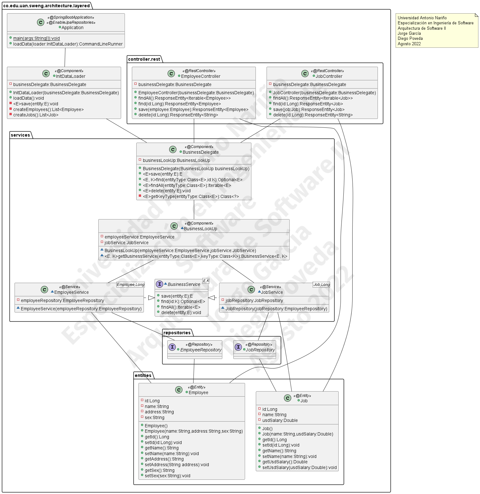
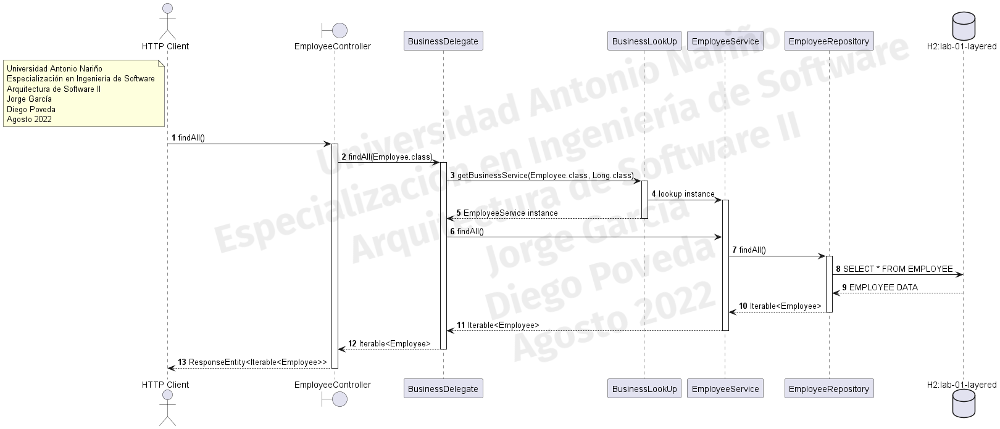

# uan-spec-sweng-architecture-2-lab-01-layered

## ES 🇪🇸

### Contexto

Proyecto realizado para la Universidad Antonio Nariño, Especialización en Ingeniería de Software, Arquitectura de
Software II, correspondiente al Laboratorio No.1 acerca de Arquitectura de Capas y el patrón Business Delegate.

### Autores

* Jorge García
* Diego Poveda

### Licencia

[GNU GENERAL PUBLIC LICENSE](LICENSE.md)

### Requisitos

* Java 17, disponible en https://adoptium.net/es/temurin/releases 
* Apache Maven 3, disponible en https://maven.apache.org/download.html 
* Tener localmente disponible el puerto 8080

### Construcción

* Ejecutar en la consola del sistema la siguiente instrucción:

```shell
mvn clean compile package 
```

* El archivo JAR lo encontrará en la carpeta `target`.

### Ejecución

* Ejecutar en la consola del sistema la siguiente instrucción:

```shell
java -jar uan-spec-sweng-architecture-2-lab-01-layered-1.0.0.jar 
```

* Ingrese a la URL: http://localhost:8080/lab-01-layered/swagger-ui/index.html
* En la consola web de OpenAPI encuentra las diferentes acciones disponibles para interactuar con los servicios REST de
  la aplicación.
* También puede interactuar con la aplicación mediante un cliente HTTP (ej. Postman) indicando como URL
  base http://localhost:8080/lab-01-layered/
* Para interactuar con la base de datos, ingrese a la URL http://localhost:8080/lab-01-layered/h2-console . Los datos de
  acceso son los siguientes:

| Campo    | Valor |
|----------|-------|
| **Controlador**  | org.h2.Driver |
| **URL JDBC** | jdbc:h2:mem:lab-01-layered  |
| **Nombre de usuario** | uan  |
| **Contraseña** | architecture  |

### Diseño

#### Diagrama de Clases

El diagrama representa el uso del patrón *Business Delegate* con base en el patrón *Proxy* para la separación de la capa
de negocio. Los controladores y el `InitDataLoader` únicamente interactúan con la clase `BusinessDelegate` para obtener
acceso a la lógica de negocio. `BusinessDelegate` a su vez utiliza la clase `BusinessLookup` para tener acceso a la clase
de servicio correspondiente a la solicitud.



#### Diagrama de Secuencia

El diagrama representa la secuencia correspondiente a la búsqueda de todos los empleados registrados en la base de datos
de la aplicación, utilizando la clase `BusinessDelegate` como único punto de interacción desde los controladores, y como
este hace uso de la clase `BusinessLookUp` para encontrar el servicio correspondiente.



### Referencias

* Mitra, S. (2018). Layered Architecture Up and Running just in 5 minutes:: Spring Boot Part 1 | Make & Know Java.
  Blogspot.com. http://javaonfly.blogspot.com/2018/09/layered-architecture-up-and-running.html
* Mitra, S. (2018, October 17). Building Layered Architecture in Just 3 Minutes: Final Part. Dzone.com;
  DZone. https://dzone.com/articles/building-layered-architecture-just-in-3-minutes-fi-1
* Core J2EE Patterns - Business Delegate. (2018).
  Oracle.com. https://www.oracle.com/java/technologies/business-delegate.html
* Design Patterns - Business Delegate Pattern. (2022).
  Tutorialspoint.com. https://www.tutorialspoint.com/design_pattern/business_delegate_pattern.htm
* baeldung. (2019, April 18). Spring Boot With H2 Database | Baeldung.
  Baeldung. https://www.baeldung.com/spring-boot-h2-database
* Proxy. (2014). Refactoring.guru. https://refactoring.guru/es/design-patterns/proxy

